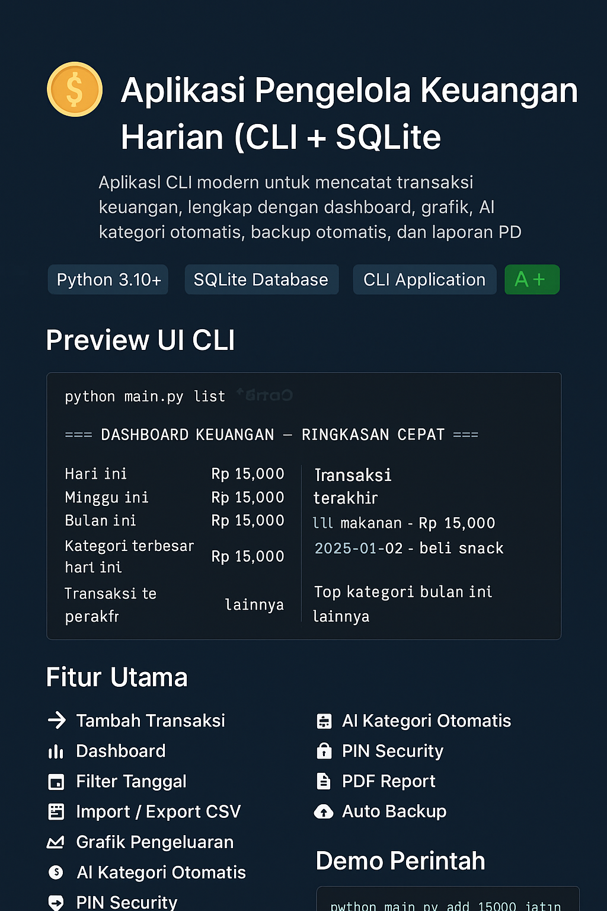
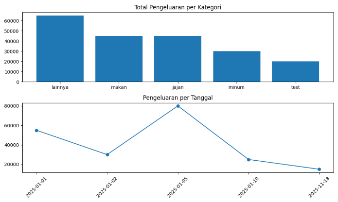

<p align="center">
  
</p>

<h1 align="center">💰 Aplikasi Pengelola Keuangan Harian (CLI + SQLite)</h1>

<p align="center">
  
  
  
  
</p>

<p align="center">
  Aplikasi CLI modern untuk mencatat transaksi keuangan, lengkap dengan dashboard, grafik, AI kategori otomatis, backup otomatis, dan laporan PDF.
</p>

---

## ▶️ Video Presentasi

<p align="center">
  <a href="https://youtu.be/1W2tmPaFEys?si=cnNEt1nz7DuWP4cJ"><b>👉 Klik di sini untuk menonton video presentasi di YouTube</b></a>
</p>

---

## 📸 Preview UI CLI

<p align="center">
  
</p>

---

## 🚀 Fitur Utama

| Fitur                       | Deskripsi                           |
| --------------------------- | ----------------------------------- |
| 📥 **Tambah Transaksi**     | Input cepat + deskripsi + tanggal   |
| 📊 **Dashboard**            | Ringkasan harian, mingguan, bulanan |
| 🔎 **Filter Tanggal**       | Tanggal tertentu atau rentang       |
| 📁 **Import / Export CSV**  | Untuk backup & migrasi data         |
| 📈 **Grafik Pengeluaran**   | Matplotlib otomatis simpan PNG      |
| 🤖 **AI Kategori Otomatis** | Menebak kategori dari deskripsi     |
| 🔐 **PIN Security**         | Melindungi akses list               |
| 📑 **PDF Report**           | Laporan siap print                  |
| 💾 **Auto Backup**          | Backup harian + auto clean 7 hari   |

---

## 🧭 Demo Perintah

### ➕ Tambah Transaksi

```shell
python main.py add 15000 jajan 2025-01-02 -d "beli snack"
```

### 📋 Dashboard

```shell
python main.py list
```

### 🎯 Filter Transaksi

```shell
python main.py filter --mulai 2025-01-01 --akhir 2025-01-31
```

### 📈 Grafik

```shell
data
python main.py graph
```

<p align="center">
  
</p>

---

## 🗂 Struktur Folder

```txt
📁 project/
│── commands/
│── utils/
│── backup/
│── graphs/
│── reports/
│── db.py
│── main.py
│── requirements.txt
│── README.md
```

---

## ⚙️ Instalasi

1. **Buat virtual environment**

```shell
python -m venv venv
```

2. **Aktifkan** (Windows)

```shell
venv\Scripts\activate
```

3. **Install dependency**

```shell
pip install -r requirements.txt
```

4. **Jalankan aplikasi**

```shell
python main.py --help
```

---

## 📄 Lisensi

Free to use, modify, and redistribute.
